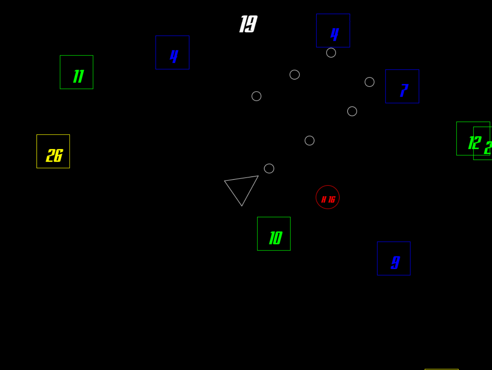

CC-Tan
=======

*Authors:
[Gianmarco Magnani](https://bitbucket.org/{67c6acb2-d787-4df3-a274-1a078d4e95d1}/),
[Lorenzo Sutera](https://bitbucket.org/{22ab3b5b-6932-4d90-81c6-ce6e2bf22280}/),
[Nicolas Pasolini](https://bitbucket.org/{b0243d4e-23ed-43b8-9209-89b7b2ad729a}/),
[Paolo Baldini](https://github.com/Mandrab).*

A 'CC-Tan' revised version.

The game is about survive an assault as long as possible, gaining point destroying enemies. Those become stronger as the time elapse. To help you, some enemies are special and allow you to gain extraordinary abilities for a limited period of time. Use them to smash your enemies harder and faster!
